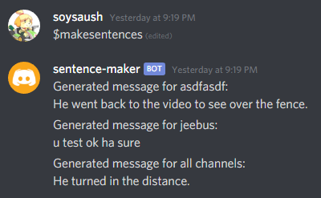

## Sentence Generator Discord Bot
Simple bot made for generating random sentences on personal discord server.
Uses [markovify library](https://github.com/jsvine/markovify) and discord.py.

``$makesentences`` to generate sentences for all channels in server the bot can read messages in.

## Setup
Create ``config.py`` in root directory with line ``TOKEN = 'yOurB0tT0k3nHere'``

Use python3

Install discord.py and markovify

run ``python3 bot.py``
